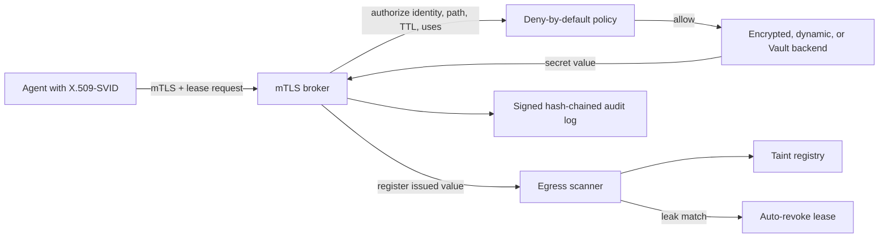
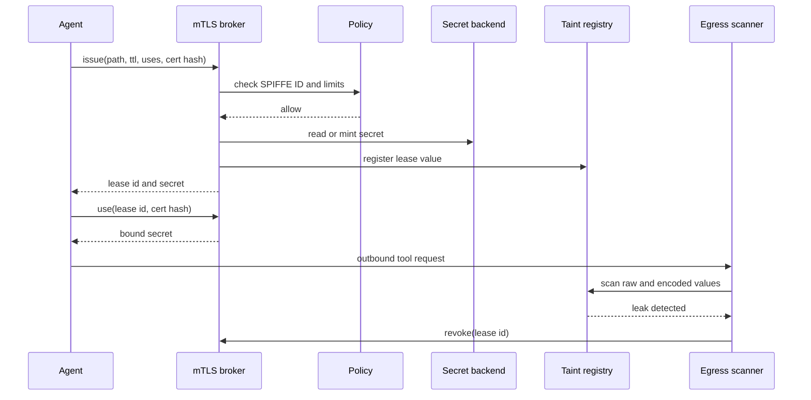
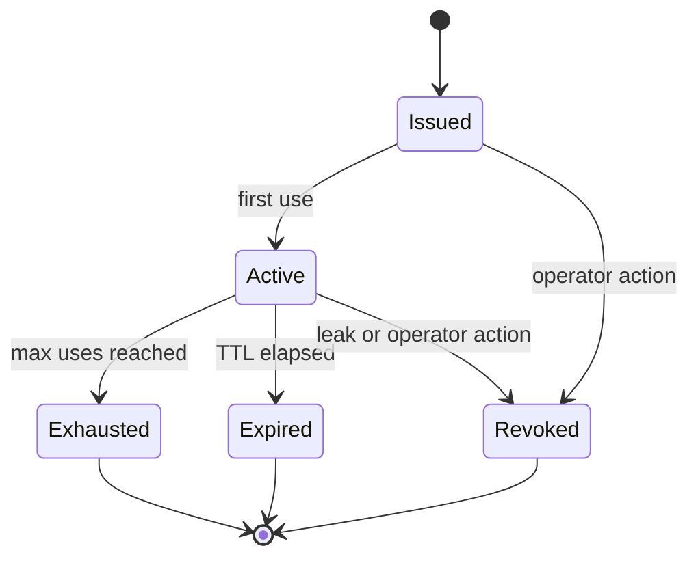

# Ephemeral Agent Secret Leasing

[](https://github.com/ephemeral-agent-secret-leasing/ephemeral-agent-secret-leasing/actions/workflows/ci.yml)
[](https://github.com/ephemeral-agent-secret-leasing/ephemeral-agent-secret-leasing/actions/workflows/formal.yml)
[](https://github.com/ephemeral-agent-secret-leasing/ephemeral-agent-secret-leasing/actions/workflows/security.yml)

Ephemeral Agent Secret Leasing is a Python broker that issues short-lived, certificate-bound secrets to AI agents authenticated with X.509-SVIDs over mTLS.

## Why I built this

Long-lived shared secrets are hard to revoke after an agent sends one through a tool call, log line, or prompt-injected workflow. I wanted the broker to make each secret narrow: one SPIFFE identity, one client certificate hash, a short TTL, and a small use count.

The project also treats leakage as an operational event. Issued values enter a taint registry, outbound requests are scanned for supported encodings, and a match denies egress and revokes the affected lease.

## How it works

The broker accepts a validated SPIFFE ID and client certificate hash from the mTLS layer. Policy is deny-by-default. Approved leases fetch or mint a secret from one backend, register the value for egress scanning, and write signed audit records.







Backends:

- AES-GCM envelope-encrypted JSON storage.
- Dynamic generated tokens for tests and local demos.
- HashiCorp Vault KV v2 through `hvac`.

## Quickstart

Linux/macOS:

```bash
python -m venv .venv
. .venv/bin/activate
python -m pip install -e ".[dev]"
ephemeral-agent-secret-leasing wilson 58 100
bash scripts/check.sh
```

Windows:

```powershell
python -m venv .venv
.\.venv\Scripts\python -m pip install -e ".[dev]"
.\.venv\Scripts\ephemeral-agent-secret-leasing wilson 58 100
bash scripts/check.sh
```

Vault integration test:

```powershell
docker run --rm -d --name ephemeral-agent-secret-leasing-vault -p 18420:8200 -e VAULT_DEV_ROOT_TOKEN_ID=root -e VAULT_DEV_LISTEN_ADDRESS=0.0.0.0:8200 hashicorp/vault:1.21
$env:ZTAP_INTEGRATION = "1"
$env:VAULT_ADDR = "http://127.0.0.1:18420"
.\.venv\Scripts\python -m pytest tests\test_integration_vault.py -q
docker rm -f ephemeral-agent-secret-leasing-vault
```

## What I measured

The reference run used Python 3.12 on Windows 11 ARM64. Benchmark rates use Zero Trust Agent Benchmark `zero-trust-agent-benchmark-dataset-v4`; `test.jsonl` SHA-256 is `4f6fff41fe77aefb2ec96336b65a58d571986e0036ac3e368cc9975ed029dfc7`. Rate intervals are Wilson 95% intervals over distinct traces.

<!-- SECRET-LEASE-RESULTS:START -->
| Metric | Reference run |
|---|---:|
| Issue p95 (in-process) | 0.434 ms |
| Issue p95 (HTTP/mTLS model) | 1.434 ms |
| Scanner throughput | 3.11 MB/s |
| Benchmark dataset | zero-trust-agent-benchmark-dataset-v4 |
| Benchmark test trace SHA-256 | `4f6fff41fe77aefb2ec96336b65a58d571986e0036ac3e368cc9975ed029dfc7` |
| Benchmark v4 overall block rate | 58.6% (95% CI 54.2-62.8%) |
| Benchmark v4 in-policy block rate | 20.0% (95% CI 15.5-25.4%) |
| Benchmark v4 out-of-policy block rate | 97.2% (95% CI 94.3-98.6%) |
| Benchmark v4 false-positive rate | 0.8% (95% CI 0.3-2.0%) |
| Benchmark v4 leaks | 0 (rate 0.0%, 95% CI 0.0-0.4%) |
| Benchmark v3 (superseded: had shortcuts) overall block rate | 58.6% (95% CI 54.2-62.8%) |
| Latest artifact | `results/20260926T060714Z-reference` |
<!-- SECRET-LEASE-RESULTS:END -->

| Claim tested | Target | Result | Outcome |
|---|---:|---:|---|
| Lease issue p95 | ≤ 12 ms | 0.434 ms | Met |
| Benchmark test leaks | 0 | 0 | Met |
| Supported encoding detection | ≥ 99% | min 1.000 | Met |
| Local scanner false-positive rate | ≤ 1% | 0.000 | Met |
| Rotation failed requests | 0 | 0 | Met |

The benchmark block rate is intentionally split. Out-of-policy attacks are mostly denied by identity, scope, and egress policy. In-policy confused-deputy attacks with valid identity, adequate scope, and allowlisted destinations are partly outside this broker's authorization boundary; secret-value exfiltration is still blocked with zero observed leaks.

## Limitations

The scanner covers raw, base64, base64url, hex, percent, fully percent-encoded, reversed, ROT13, JSON-escaped, and split tokens. It does not claim coverage for paraphrase, screenshots, steganography, timing channels, encrypted covert channels, or manual retyping outside scanned tool arguments.

The Starlette API expects the deployment edge to verify mTLS and pass the SPIFFE ID plus certificate hash to the broker. The local CA is for tests. Vault tests require a reachable Vault dev server and `ZTAP_INTEGRATION=1`.

## License

Apache-2.0. See `LICENSE`. For software citation metadata, see `CITATION.cff`.
