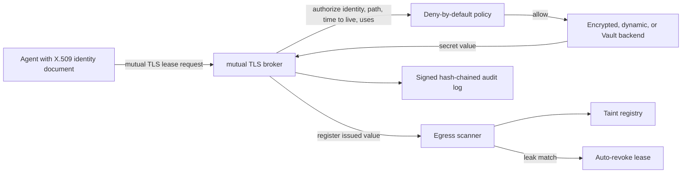
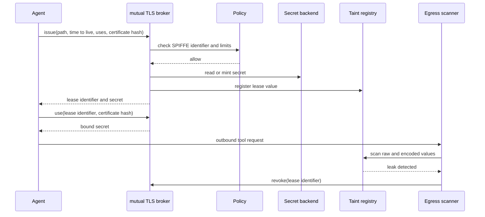
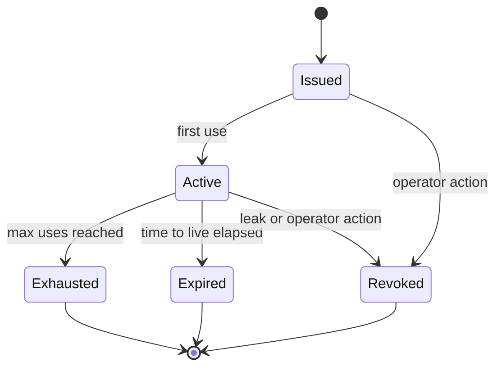

<p align="center"></p>

# Ephemeral Agent Secret Leasing

[](https://github.com/ephemeral-agent-secret-leasing/ephemeral-agent-secret-leasing/actions/workflows/ci.yml)
[](https://github.com/ephemeral-agent-secret-leasing/ephemeral-agent-secret-leasing/actions/workflows/formal.yml)
[](https://github.com/ephemeral-agent-secret-leasing/ephemeral-agent-secret-leasing/actions/workflows/security.yml)

Ephemeral Agent Secret Leasing is a Python broker that issues short-lived, certificate-bound secrets to workload agents authenticated with Secure Production Identity Framework For Everyone (SPIFFE) X.509 SPIFFE Verifiable Identity Documents (SVIDs) over mutual TLS (mTLS).

## Why I built this

Long-lived shared secrets are hard to revoke after an agent sends one through a tool call, log line, or prompt-injected workflow. I wanted the broker to make each secret narrow: one SPIFFE identity, one client certificate hash, a short time to live, and a small use count.

The project also treats leakage as an operational event. Issued values enter a taint registry, outbound requests are scanned for supported encodings, and a match denies egress and revokes the affected lease.

## How it works

The broker accepts a validated SPIFFE identifier and client certificate hash from the mutual TLS layer. Policy is deny-by-default. Approved leases fetch or mint a secret from one backend, register the value for egress scanning, and write signed audit records.







Backends:

- Advanced Encryption Standard Galois/Counter Mode (AES-GCM) envelope-encrypted JSON storage.
- Dynamic generated tokens for tests and local demos.
- HashiCorp Vault key-value (KV) v2 through `hvac`.

## Quickstart

Linux/macOS:

```bash
python -m venv .venv
. .venv/bin/activate
python -m pip install -e ".[dev]"
ephemeral-agent-secret-leasing wilson 58 100
bash scripts/check.sh
```

Windows:

```powershell
python -m venv .venv
.\.venv\Scripts\python -m pip install -e ".[dev]"
.\.venv\Scripts\ephemeral-agent-secret-leasing wilson 58 100
bash scripts/check.sh
```

Vault integration test:

```powershell
docker run --rm -d --name ephemeral-agent-secret-leasing-vault -p 18420:8200 -e VAULT_DEV_ROOT_TOKEN_ID=root -e VAULT_DEV_LISTEN_ADDRESS=0.0.0.0:8200 hashicorp/vault:1.21
$env:RUN_INTEGRATION_TESTS = "1"
$env:VAULT_ADDR = "http://127.0.0.1:18420"
.\.venv\Scripts\python -m pytest tests\test_integration_vault.py -q
docker rm -f ephemeral-agent-secret-leasing-vault
```

## What I measured

The reference run used Python 3.12 on Windows 11 ARM64 hardware. Benchmark rates use Zero Trust Agent Benchmark `zero-trust-agent-benchmark-dataset-v4.1`; `test.jsonl` SHA-256 is `d065bab9bed145490579cd7add6a574c6e23c21c0ea4525dc1c14b0fc15acd2b`. Rate intervals are Wilson 95% confidence intervals over distinct traces. An earlier benchmark version had shortcut templates, so v4 replaced it and only v4 results are reported here.

<!-- SECRET-LEASING-RESULTS:START -->
| Metric | Reference run |
|---|---:|
| Issue 95th percentile (in process) | 0.434 milliseconds |
| Issue 95th percentile (Hypertext Transfer Protocol over mutual TLS model) | 1.434 milliseconds |
| Scanner throughput | 3.11 megabytes per second |
| Benchmark dataset | zero-trust-agent-benchmark-dataset-v4.1 |
| Benchmark test trace SHA-256 digest | `d065bab9bed145490579cd7add6a574c6e23c21c0ea4525dc1c14b0fc15acd2b` |
| Benchmark v4 overall block rate | 92.8% (95% confidence interval 90.2-94.8%) |
| Benchmark v4 in-policy block rate | 88.0% (95% confidence interval 83.4-91.5%) |
| Benchmark v4 out-of-policy block rate | 97.6% (95% confidence interval 94.9-98.9%) |
| Benchmark v4 false-positive rate | 1.8% (95% confidence interval 0.9-3.4%) |
| Benchmark v4 leaks | 0 (rate 0.0%, 95% confidence interval 0.0-0.4%) |
| Benchmark decision 95th percentile latency | 0.155 milliseconds |
| Latest artifact | `results/benchmark-test` |
<!-- SECRET-LEASING-RESULTS:END -->

| Claim tested | Target | Result | Outcome |
|---|---:|---:|---|
| Lease issue 95th percentile | ≤ 12 milliseconds | 0.434 milliseconds | Met |
| Benchmark test leaks | 0 | 0 | Met |
| Supported encoding detection | ≥ 99% | minimum 1.000 | Met |
| Local scanner false-positive rate | ≤ 1% | 0.000 | Met |
| Rotation failed requests | 0 | 0 | Met |

### Benchmark ablation

To avoid test-set tuning, only the already published version 1 and the final design were scored on the test split.

| Version | Block rate | False-positive rate | Leak rate | Decision p95 latency |
|---|---:|---:|---:|---:|
| Version 1 | 58.6% (95% confidence interval 54.2-62.8%) | 0.8% (95% confidence interval 0.3-2.0%) | 0.0% (95% confidence interval 0.0-0.4%) | 0.167 ms |
| Final: sender-constrained lease references, requester authority checks, privilege grants, parser hardening, and independent encoded-secret detection | 92.8% (95% confidence interval 90.2-94.8%) | 1.8% (95% confidence interval 0.9-3.4%) | 0.0% (95% confidence interval 0.0-0.4%) | 0.155 ms |

The benchmark block rate is intentionally split. Secret exfiltration, lease-reference misuse, undeclared lease egress, and requester-authority failures are broker concerns and are blocked with zero observed leaks. Tool hijacking and other confused-deputy actions that use valid identity, adequate scope, and no secret material remain partly outside this broker's authorization boundary.

## Limitations

The scanner covers raw, base64, base64url, hex, percent, fully percent-encoded, reversed, ROT13, JSON-escaped, and split tokens. It does not claim coverage for paraphrase, screenshots, steganography, timing channels, encrypted covert channels, or manual retyping outside scanned tool arguments.

The Starlette application programming interface (API) expects the deployment edge to verify mutual TLS and pass the SPIFFE identifier plus certificate hash to the broker. The local certificate authority is for tests. Vault tests require a reachable Vault dev server and `RUN_INTEGRATION_TESTS=1`.

## License

Apache-2.0. See `LICENSE`. For software citation metadata, see `CITATION.cff`.
